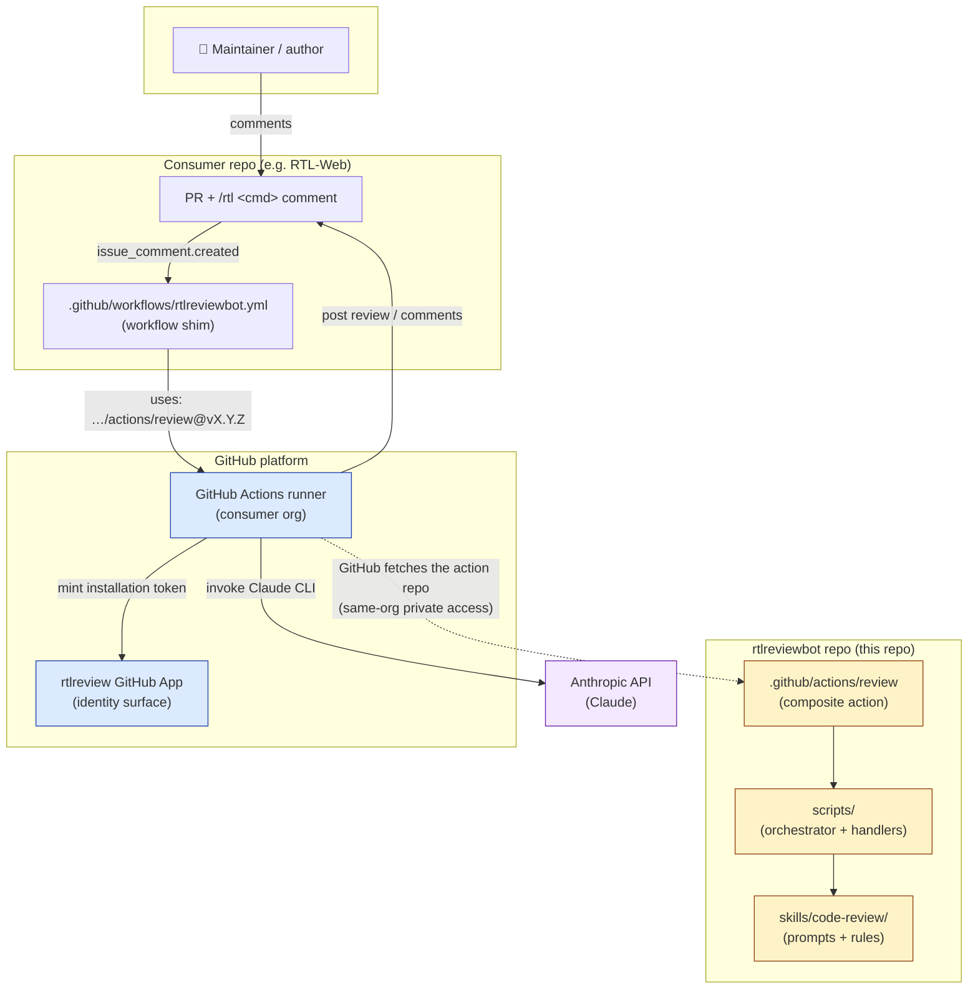
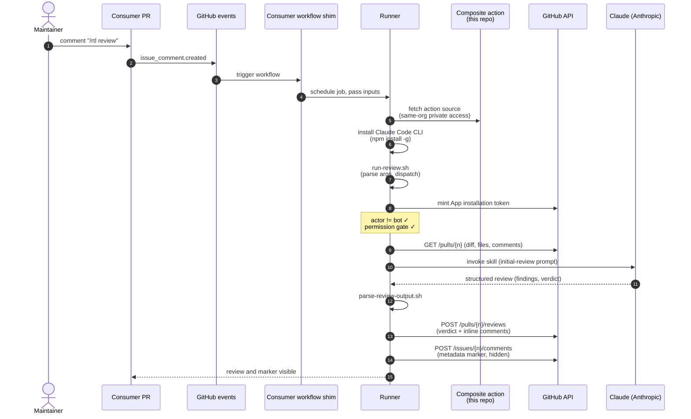
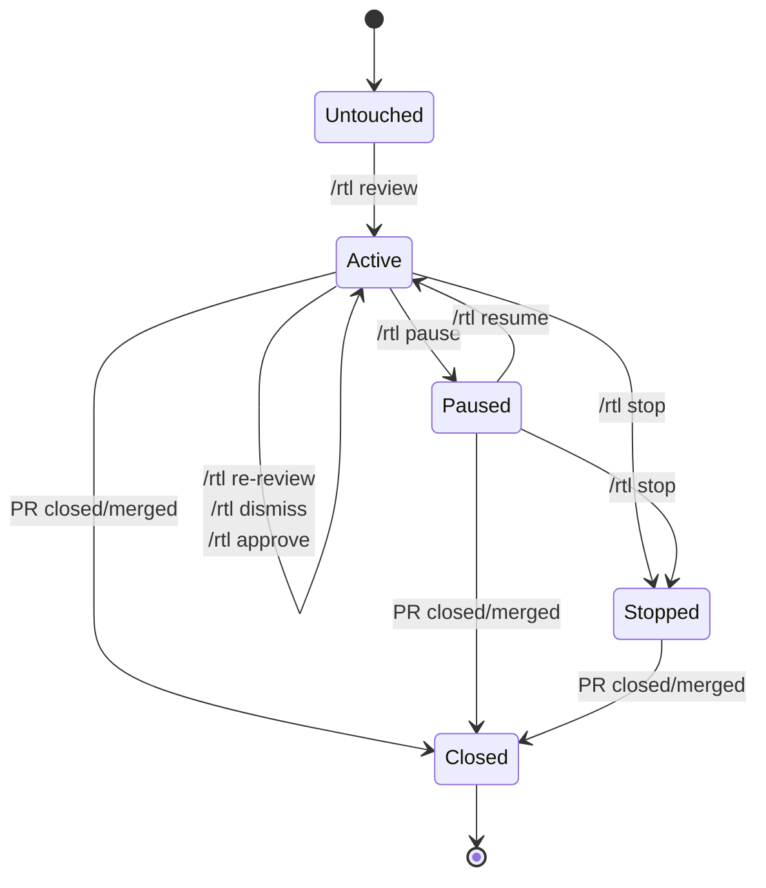
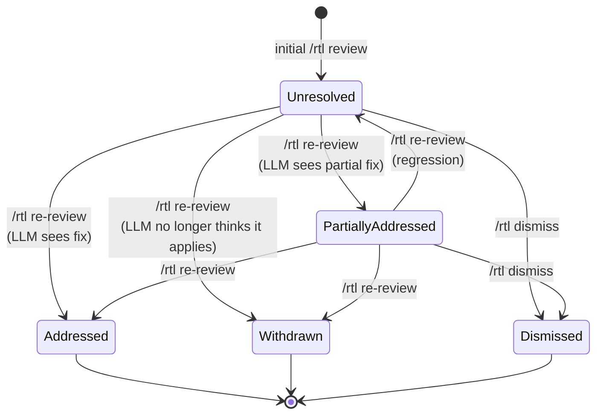

# Architecture

rtlreviewbot is a maintainer-invoked code-review bot for GitHub pull
requests. Reviews are produced by Claude (the LLM) under the
`code-review` skill in this repo, posted as formal GitHub PR reviews,
and tracked across iterations via a hidden marker comment on the PR.

The bot is **advisory**, not a merge gate:

- It produces verdicts of `REQUEST_CHANGES` or `COMMENT` — never
  `APPROVE` from the LLM. (`/rtl approve` exists as a maintainer-driven
  command that emits a deterministic, marker-validated APPROVE; it
  does not invoke the LLM.)
- The bot does not decide whether to merge.
- The bot does not replace human review on critical paths
  (consensus, cryptography, HTLC handling).

## Layered topology



The four moving parts:

1. **GitHub App (`rtlreview`)** — pure identity surface. Mints
   short-lived installation tokens (1 hour TTL, per-repo scope) that
   the runner uses to read the PR, post reviews, and react to
   comments. The App has no webhooks and no hosted server.
2. **rtlreviewbot repo (this repo)** — holds the composite action that
   consumers invoke, the orchestrator scripts that run inside it, and
   the LLM skill (prompts + rule stubs). Versioned by git tags;
   consumers pin to a release tag.
3. **Consumer repo** — installs the App, drops the workflow shim from
   `templates/rtlreviewbot.yml` into `.github/workflows/`, and stores
   the App credentials and Anthropic auth as secrets. Maintainers
   invoke the bot by typing `/rtl <command>` in PR comments.
4. **Anthropic API** — the LLM endpoint. Reached by the Claude Code
   CLI installed at the start of every workflow run. Consumers can
   pass either an `ANTHROPIC_API_KEY` (per-token billing) or a
   `CLAUDE_CODE_OAUTH_TOKEN` (Claude.ai subscription billing); both
   are accepted with API tried first and OAuth as fallback.

There is **no hosted rtlreviewbot service**. Every invocation runs in
the consumer's own GitHub Actions runner; this repo is just the
versioned source the runner pulls from.

## Execution model — `/rtl review` end to end



Step-by-step:

1. **Comment** — a maintainer types `/rtl review` on a PR.
2. **Event** — GitHub fires `issue_comment.created` to the workflow
   shim in the consumer repo. The shim's job-level `if:` filters out
   non-PR issue comments.
3. **Composite-action fetch** — the runner sees `uses:
   Ride-The-Lightning/rtlreviewbot/.github/actions/review@<TAG>` and
   fetches the action repo using its own internal mechanism. Because
   the rtlreviewbot repo's `actions/permissions/access` is set to
   `organization`, same-org consumers get access without needing a
   token that can read it. (Pre-v0.8.0 the bot was a *reusable
   workflow* and required `actions/checkout` of itself, which broke
   under private — that's why the v0.8.0 refactor moved to a
   composite action.)
4. **Claude CLI install** — the action's first step installs
   `@anthropic-ai/claude-code` globally on the runner.
5. **`run-review.sh` dispatch** — the action's second step invokes
   `scripts/run-review.sh`. Every input is routed through `env:`
   rather than substituted into the run script body, so a comment
   body containing shell metacharacters (backticks, parens) cannot
   inject commands.
6. **Authentication and gating** — `run-review.sh` mints the App
   installation token, sets `GH_TOKEN`, runs the loop-prevention
   check (`actor == BOT_LOGIN` → exit 0), parses the command, and
   permission-gates per the table in [§ Permission model](#permission-model).
7. **Handler dispatch** — for `/rtl review`, the dispatcher `exec`s
   `scripts/handlers/handle-review.sh`. (Other `/rtl` commands route
   to their respective `handle-*.sh`.)
8. **PR context fetch** — `scripts/fetch-pr-context.sh` pulls the
   diff, file list, comments, and review comments via the GitHub
   API; truncates the diff if it exceeds 300k characters.
9. **LLM invocation** — `scripts/lib/invoke-claude.sh` calls the
   Claude CLI with the `code-review` skill and the appropriate
   prompt (`prompts/initial-review.md` for `/rtl review`).
10. **Output parsing** — `scripts/parse-review-output.sh` extracts
    `<finding>` blocks, the `## Verdict` line, and the summary into a
    structured JSON object. Parser failure is fatal — better to bail
    than post a malformed review.
11. **Review submission** — `scripts/post-review.sh` POSTs a formal
    review with inline comments (severity-prefixed:
    🔴 blocker / 🟠 major / 🟡 minor / 🔵 nit). On API rejection
    (e.g., a finding cited a line not in the diff), it falls back to
    a body-only review with all findings demoted to a list.
12. **Marker write** — `scripts/update-metadata.sh --mode write`
    writes the marker comment with finding IDs, statuses, and audit
    fields. The marker is the canonical state for everything that
    follows (`/rtl re-review`, `/rtl explain`, `/rtl approve`).

### Other entry points

- **`pull_request.closed`** — triggers `handle-close.sh`, which strips
  the `rtl-active` / `rtl-paused` labels and appends a terminal
  record to the marker (`closed_at`, `merged`). Silent — no comment
  posted.
- **`pull_request.review_requested`** — listener exists for
  forward-compatibility but does not currently fire for the bot:
  GitHub's Re-request review API silently rejects App accounts. The
  canonical re-review path is the `/rtl re-review` comment command.

## State model

The bot tracks two pieces of state per PR.

### Labels

| Label | Meaning |
|---|---|
| `rtl-active` | The bot has reviewed this PR at least once and is willing to react to subsequent `/rtl <cmd>` commands. Set by `handle-review.sh`. |
| `rtl-paused` | An author or maintainer has temporarily silenced the bot. New `/rtl <cmd>` invocations are no-ops until `/rtl resume`. Set by `handle-pause.sh`, removed by `handle-resume.sh`. |

Labels are convenient for visual filtering (`is:open label:rtl-active`)
but are *not* the authoritative state — that lives in the marker.

### The metadata marker comment

A single hidden HTML-comment block on the PR, authored by the
`rtlreview[bot]` App identity. The body contains a JSON object between
sentinels:

```
🤖 rtlreviewbot audit metadata for this PR — auto-generated, please don't edit.

<!-- rtlreviewbot-meta
{
  "version": "1.1",
  "last_reviewed_sha": "<sha>",
  "last_reviewed_at": "<utc>",
  "skill_version": "<from skills/code-review/SKILL.md>",
  "model": "<claude model id>",
  "findings": [
    {
      "id": "F1",
      "severity": "blocker|major|minor|nit",
      "status": "unresolved|partially_addressed|addressed|withdrawn",
      "path": "<path>",
      "line": <int>,
      "body": "<finding body>",
      "first_raised_sha": "<sha>",
      "inline_comment_id": <int>|null
    }
  ],
  "dismissed_findings": [
    {"id": "F3", "by": "<actor>", "reason": "<text>", "at": "<utc>"}
  ],
  "approved_by": "<actor>",        // present after /rtl approve
  "approved_at": "<utc>",          // present after /rtl approve
  "closed_at": "<utc>",            // present after PR close
  "merged": <bool>                 // present after PR close
}
-->
```

The marker is read/written via `scripts/update-metadata.sh`. There is
at most one marker per PR; the script PATCHes in place rather than
posting a second one. Identity is enforced by both the sentinel string
*and* the comment author — only the App's installation token can post
comments authored by `rtlreview[bot]`, so a marker matching both is
provably ours.

### PR-level state transitions



`Stopped` and `Paused` differ in intent: `pause` is a soft mute (later
`resume` is expected), `stop` is a hard exit (the bot is no longer
welcome on this PR; the marker is left in place as audit but no labels
remain).

## Finding lifecycle

Each finding is identified by a stable `Fn` integer, allocated
sequentially by the LLM at first sight and preserved across re-reviews
via the marker merge in `handle-re-review.sh`. New findings introduced
by later commits continue the sequence.



`Dismissed` is recorded in the parallel `dismissed_findings` array
(with `by`, `reason`, `at` audit fields) — the original finding stays
in `findings` but stops counting toward verdicts and approval gates.

`/rtl approve` is a separate, deterministic flow: it does not change
finding statuses but writes `approved_by` / `approved_at` audit fields
on the marker after verifying that every entry in `findings` is
`addressed`/`withdrawn` or appears in `dismissed_findings`.

## Permission model

| Command | Who can invoke | Reason |
|---|---|---|
| `/rtl review` | maintainer | Activates the bot; commits Anthropic spend |
| `/rtl re-review` | maintainer | Re-spends; same trust class as review |
| `/rtl dismiss <id> [reason]` | maintainer | Silences a real finding — needs review-class authority |
| `/rtl approve` | maintainer | Submits a formal APPROVE; counts toward branch protection |
| `/rtl stop` | maintainer or author | Either party can deactivate the bot |
| `/rtl pause` / `/rtl resume` | maintainer or author | Same as stop, soft form |
| `/rtl explain <id>` | anyone | Read-only elaboration; no spend on a fresh diff |

"maintainer" = GitHub permission `write` or `admin` on the repository
(verified via the collaborators API). "author" = the PR's
`user.login`. Permission gating happens in `run-review.sh` before any
handler dispatch.

## Security model

### Token scope and identity

The runner does **not** use the consumer's `GITHUB_TOKEN` for any
GitHub API call. Every API call is made via an App installation token
minted at the start of each run from the App's private key. Properties:

- **TTL ~1 hour** — short-lived; nothing to leak past the workflow run.
- **Scoped to one repo** — the installation token authorizes only the
  permissions the App was granted on that specific installation.
- **Identity is `rtlreview[bot]`** — every comment, reaction, label
  change, and review the bot performs is signed by this identity in
  the GitHub UI. There is no way for the bot to act under a human
  identity.

The shim's `permissions:` block is set to `contents: read` purely for
defense in depth; the workflow doesn't actually use `GITHUB_TOKEN`.

### Fork safety

`/rtl <cmd>` triggers fire on `issue_comment.created`, which by
GitHub's design runs in the **base repo's** workflow context — not the
fork's. Secrets stored in the base repo are accessible; the fork
itself does not see them, cannot intercept them, and cannot inject
malicious workflow code into the run.

A fork-author cannot invoke `/rtl review` (permission gate denies),
but they could in principle invoke `/rtl explain <id>` if a finding
exists. That handler is read-only with respect to GitHub state and
does not touch fork content.

### Audit trail

Every state-changing operation lands in the marker with an actor
identity:

- `last_reviewed_sha` / `last_reviewed_at` — set on every `/rtl
  review` and `/rtl re-review`.
- `skill_version` / `model` — pinned per run, so a finding's
  provenance is reproducible.
- `dismissed_findings[*]` — `{id, by, reason, at}` per dismissal.
- `approved_by` / `approved_at` — set on `/rtl approve`.
- `closed_at` / `merged` — set on `pull_request.closed`.

Plus everything has the GitHub-side audit: comment author identity,
review timeline, label-change history.

### Loop prevention

`run-review.sh` checks `actor == BOT_LOGIN` very early (before
authentication or any expensive work) and exits 0 silently if the
trigger came from the bot's own activity. This catches the case where
the bot's marker-comment post fires `issue_comment.created` again.

A second pass filters known automation accounts (`dependabot[bot]`,
`renovate[bot]`, `github-actions[bot]`) defensively — they don't
invoke `/rtl <cmd>`, but if their comments ever did contain something
parser-recognizable we don't want to react.

### Shell-injection hardening

All workflow inputs flow through the action's `env:` block and are
referenced as `$VAR` in the run script. Direct `${{ inputs.X }}`
substitution into shell text is a known GitHub Actions footgun — bash
sees the substituted value at parse time and will execute backticks,
`$(...)`, etc. embedded in user-controlled fields like `comment_body`.
The env-variable indirection neutralizes those metacharacters.

## LLM invocation

The skill at `skills/code-review/` is invoked in three modes by the
orchestrator:

| Mode | Prompt | Triggered by |
|---|---|---|
| Initial review | `prompts/initial-review.md` | `/rtl review` |
| Re-review | `prompts/re-review.md` | `/rtl re-review` |
| Explain | `prompts/explain.md` | `/rtl explain <id>` |

`/rtl approve`, `/rtl dismiss`, `/rtl pause`, `/rtl resume`, and
`/rtl stop` are handled deterministically by their respective
`handle-*.sh` scripts and **do not invoke the LLM**.

### Domain rules

The skill applies two layers:

1. **Domain-specific rules** — `skills/code-review/rules/lightning.md`
   and `rules/security.md`. These are intentionally fill-in-by-experts
   stubs as of v0.9.0. The bot does not invent Lightning-specific or
   security-specific claims when the rule files are empty.
2. **General best practices** — fallback when no specific rule
   applies. Standard concerns: error handling, resource management,
   concurrency safety, test coverage of new branches.

Authoring the domain rules is on the deferred-followup list and is
expected to be done by senior Lightning engineers and security
reviewers, not by Claude.

### Auth fallback

`scripts/lib/invoke-claude.sh` inspects `ANTHROPIC_API_KEY` and
`CLAUDE_CODE_OAUTH_TOKEN` at call time. If both are set it tries API
first and OAuth as fallback; failure of the API path is detected by
the parser-as-oracle pattern (exit 0 *and* parser acceptance is
required for success), so soft failures like "Credit balance too low"
don't escape as bogus reviews.

## Versioning and layout

Consumers pin a release tag in their workflow shim:

```yaml
uses: Ride-The-Lightning/rtlreviewbot/.github/actions/review@v0.9.0
```

The composite action and the orchestrator scripts ship from the same
git tag, so there is no version skew between the action contract and
the script behavior. Bumping the tag in the consumer shim is the only
update step on a release.

Repo layout (high-level — see `README.md` for full table):

```
.github/actions/review/    composite action — consumer entry point
scripts/                   orchestrator scripts (run-review, post-review, ...)
scripts/handlers/          one script per /rtl <cmd>
scripts/lib/               source-only shell helpers (gh, claude, labels)
skills/code-review/        SKILL.md + prompts/ + rules/
templates/rtlreviewbot.yml canonical consumer workflow shim
config/defaults.yml        defaults (config-loader is a v0.9.x+ followup)
docs/                      this file, commands.md, consumer-setup.md, troubleshooting.md
tests/unit/                bats coverage for handlers and parsers
```

Per-release CHANGELOG entries cover the user-visible changes.
