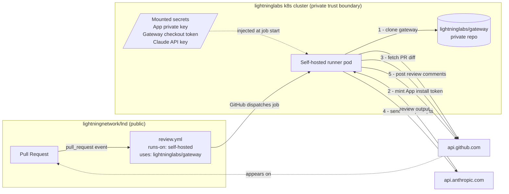

# Gateway Review Bot — Architecture Proposal & Integration Asks

**Audience:** DevOps lead, lightninglabs
**Status:** Draft for review — architecture aligned with CTO, asking for DevOps input on integration mechanics
**Author:** Suheb Khan
**Date:** 2026-05-04

## Summary

We're building **gateway**, a GitHub-App-based review bot that runs Claude
on PRs in `lightningnetwork/lnd` and posts inline review comments. The
bot's source code (prompts, domain rules, review logic) will live in a
private repo at `lightninglabs/gateway`. Reviews execute as a GitHub
Actions job triggered from lnd's CI, on **self-hosted runners in the
lightninglabs k8s cluster** — the same runner pool lnd's broader CI is
migrating to.

This document describes the proposed shape and lists the concrete
integration asks for the DevOps team.

## Context

Two constraints shape the design:

1. **lnd is public, gateway must stay private.** The bot's prompts and
   domain rules are not for public distribution.
2. **Cross-org private-repo consumption from a public CI is not
   supported by GitHub** without GitHub Enterprise Cloud (`internal`
   visibility), and we are not on GHEC.

Self-hosted runners on the lightninglabs cluster resolve both: the
runner sits inside lightninglabs's auth boundary, so it can clone
`lightninglabs/gateway` directly with a mounted token. lnd's public
workflow file just declares `runs-on: [self-hosted, <label>]` and
`uses: lightninglabs/gateway/<action>@v1` — the private checkout
happens transparently on our infra.

This piggybacks on the existing CI migration moving lnd to self-hosted
runners (driven independently by GitHub-hosted runner performance on
lnd). The review bot is one more workflow consumer on the same pool.

## Architecture

### Moving parts

The five moving parts:

1. **GitHub App (`gateway`)** — pure identity surface, registered
   under `lightninglabs`. Mints short-lived installation tokens
   (1 hour TTL, per-repo scope) that the runner uses to read PRs on
   lnd, post reviews, and react to comments. No webhooks, no hosted
   server.
2. **`lightninglabs/gateway` repo (private)** — holds the composite
   action consumers invoke, the orchestrator scripts that run inside
   it, the LLM prompts, and the lnd-specific domain rules. Versioned
   by git tags; lnd pins to a release tag.
3. **lnd workflow shim** — a single workflow file at
   `.github/workflows/gateway-review.yml` in `lightningnetwork/lnd`.
   Triggers on `pull_request` and `issue_comment`, declares
   `runs-on: [self-hosted, <lightninglabs-pool>]`, and invokes
   `lightninglabs/gateway/.github/actions/review@<TAG>`. App
   credentials and Claude API auth live as repo secrets on lnd.
4. **Self-hosted runner pool (lightninglabs k8s cluster)** — the
   piece that makes this architecture work. Runners sit inside
   lightninglabs's trust boundary, so they can clone the private
   `gateway` repo at job time with a mounted credential. From lnd's
   CI perspective a runner is "just another runner"; from the
   security perspective it is a private execution environment that
   happens to read a public repo's PR.
5. **Anthropic API** — the LLM endpoint. Reached by the Claude Code
   CLI installed at the start of each workflow run. API key sourced
   from the existing lightninglabs Claude-pods budget (see asks §4).

There is **no hosted gateway service**. Every review runs inside a
self-hosted runner job dispatched by lnd's GitHub Actions; the
gateway repo is just the versioned source the runner pulls from.

### Auth surfaces involved

| Credential | Purpose | Sensitivity |
|---|---|---|
| **Gateway checkout token** | runner clones `lightninglabs/gateway` | read-only, scoped to gateway |
| **GitHub App private key** | mint installation token to post reviews on lnd | high — issuance authority |
| **Claude API key** | run the actual review | metered, presumably shared with existing Claude-pod budget |

All three are needed *only on review-job runners*, not the broader
runner pool.

### Workload profile

| Dimension | Estimate |
|---|---|
| Trigger | `pull_request` (opened/synchronize/reopened), plus `issue_comment` for `/gateway` style commands |
| Concurrency | low — bounded by lnd PR activity, typically <10 concurrent |
| Job duration | 1–5 min (mostly latency on Claude API; CPU light) |
| Compute footprint | small — essentially an HTTP client + diff parsing |
| Egress required | `api.github.com`, `api.anthropic.com` |
| Storage | none persistent; ephemeral workspace per job |

## How it fits into the existing CI migration

We need nothing new from the runner pool itself — we're an additional
consumer of capacity that's already being provisioned for lnd. The
delta vs. a generic lnd CI job is:

- Three additional secrets need to be reachable by review jobs (gateway
  checkout, App private key, Claude API key)
- Egress to `api.anthropic.com` must be allowed
- Optionally: a dedicated runner label or runner group, if you want to
  isolate review-bot jobs from regular lnd CI for capacity or security
  reasons

## Asks for DevOps

These are the concrete integration questions / requests. None are
expected to be hard; we want to align on the shape before scaffolding
gateway.

### 1. Runner targeting

- **What runner label or group should `runs-on:` reference** for
  review-bot jobs?
- Should review jobs go to the same pool as lnd's general CI, or do you
  want a separate label (e.g. `review-bot`) for capacity isolation?

### 2. Gateway checkout credential

The runner needs to clone `lightninglabs/gateway` at job time. Three
options, please advise:

- **(a) Token mounted into the runner workspace** (e.g. via env var or
  file from a k8s Secret), used by `gh repo clone` in the action
- **(b) Deploy key on gateway**, runner has the private key
- **(c) Bake gateway into the runner image** at build time so no
  runtime checkout is needed — simplest at runtime, but requires runner
  image rebuild on every gateway change

Option (a) is the most flexible and matches typical patterns. Open to
your preference based on existing secret-management conventions.

### 3. GitHub App registration & private key storage

- Where should the **gateway GitHub App** be registered? Default
  proposal: under the `lightninglabs` org, owned by the platform team.
- How should the **App private key** (PEM) be made available to review
  jobs? k8s Secret + env var? Vault? Existing pattern from Claude pods?

### 4. Claude API key

- Can review jobs use the **existing Claude API key budget** that
  powers the in-cluster Claude pods, or do we need to provision a
  separate key?
- Same delivery question — k8s Secret? Existing convention?

### 5. Network egress

- Confirm runners are allowed egress to `api.anthropic.com` (port 443)
  in addition to whatever's already permitted for `api.github.com`.

### 6. Onboarding flow

- Once gateway is built and an initial workflow file is ready, what's
  the path to merge it into `lightningnetwork/lnd`'s
  `.github/workflows/`? Is there a CODEOWNERS / approval bar we should
  plan for?

## Open questions for discussion

- **Runner image variant:** is there an existing runner image we should
  extend (with `gh`, our checkout token, etc.), or do we ship a
  dedicated review-bot image?
- **Observability:** what's the standard for logs and metrics for jobs
  on the cluster pool? We'd like review-failure rate, Claude API
  latency, and review-duration metrics surfaced somewhere queryable.
- **Failure modes:** if Claude API is down or returns an error, the
  review job will fail. Do you want it to surface as a red CI check
  (current default), or a soft-fail that just doesn't post a review?
- **Re-run UX:** standard "Re-run job" works out of the box on
  Actions; just confirming nothing in the runner setup interferes.

## Out of scope for this conversation

These are *our* problem, not asks for DevOps:

- Bot source code (review logic, prompts, domain rules) — owned by the
  gateway team
- Review-quality tuning, prompt engineering, domain rule authorship
- The actual content of lnd's workflow file (we'll draft it and put it
  through normal review)
- GitHub App permissions/scopes (we'll specify; just need to know where
  to register it)

## Reference: prior art

This design is a direct port of the **rtlreviewbot v0.8.0** pattern
(currently running on Ride-The-Lightning's RTL repo via a private
GitHub App). The substitutions are:

- **Source repo:** rtlreviewbot (separate org) → `lightninglabs/gateway`
- **Runner:** GitHub-hosted → lightninglabs self-hosted pool
- **Cross-org constraint:** previously hit a wall on RTL onboarding;
  self-hosted runners eliminate it cleanly

The composite-action structure, the App-token-minting code, the diff
fetch + Claude call + comment posting flow — all carries over
unchanged.
